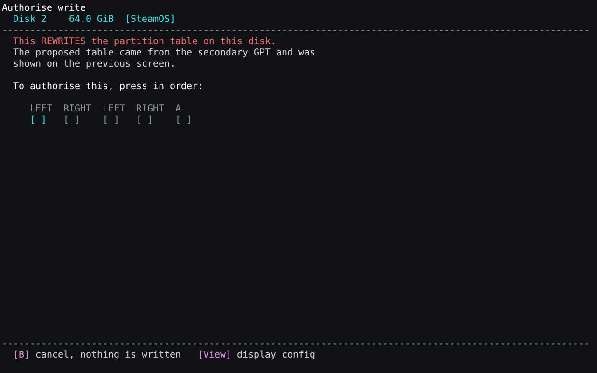
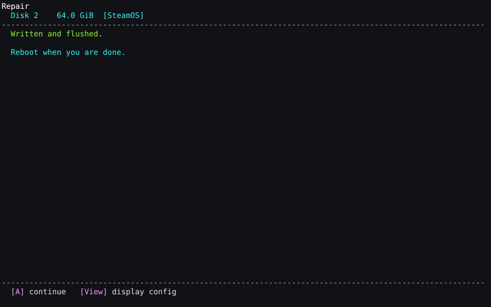

# EFI Boot Fixer for Steam Deck

A UEFI application for inspecting, repairing, backing up and restoring GUID
partition tables (GPT), along with viewing and modifying the NVRAM boot entries
that might get modified or deleted during a SteamOS or Windows upgrade in a
dual-boot setup.

## The reason it was created

When dual-booting SteamOS and Windows, more often than not you'll run into issues
when upgrading them, as they don't tolerate each other very well, and like to take
all the room for themselves (well, especially Windows).

The upgrade to Windows 24H2 is especially infamous with this, symptoms are either:

- Black screen when booting SteamOS, even manually through `steamcl.efi`
- Dropping you to a `grub>` prompt after attempting to boot
- Verbose boot logs ending in `ERROR: Mounting /dev/disk/bypartuuid/<UUIDOFYOURPARTITION> failed.`

This precise upgrade is known to corrupt the main GPT, this is what this tool
was written for, but it now supports more features to (hopefully) always be able to salvage
your Steam Deck that no longer boots, even if you're on the go and don't have any
USB keyboard at hand, and no USB recovery key.

## Features

All driven with the D-pad, no keyboard required:

- **Diagnose at a glance**: one read-only page covering every disk's
  partition table, the boot list and the loaders found on the ESPs.
- **Save a diagnostic report**: everything the machine will say — what
  SMBIOS calls it (with the serial numbers masked), every GPT header field,
  every partition GUID, every boot entry, the Secure Boot state, the whole
  variable store — to a text file on the ESP
  or a USB stick, to attach to a forum post instead of answering questions
  one at a time. Nothing is modified to produce it.
- **Repair a corrupt GPT**: rebuilds a broken main GPT from the secondary
  one, the fix for the infamous Windows 24H2 dual-boot corruption.
- **Back up and restore GPTs**: snapshot both partition tables to the ESP,
  a USB stick or an SD card, and write them back later.
- **Inspect and fix NVRAM boot entries**: view the firmware's boot list
  (including entries that fell out of it), scan the ESPs for loaders,
  register a missing one, change the default, boot something once without
  committing to it, or restore a saved boot configuration.
- **Prevent the Windows 24H2 corruption from recurring** (experimental): modifies
  the primary GPT so that on the next upgrade, Windows doesn't break it (hopefully),
  more information available about the rationale behind this in [docs/corruption.md](docs/corruption.md).
  Note that this theory might end up being wrong (Windows is closed source),
  and it has just been tested on my hardware. You're welcome to test it, but
  you've been warned.

## Screenshots

### The main menu


### Check this machine

One read-only screen checking every disk's GPT, the firmware's boot list, and
the loaders found on the ESPs, pointing to the proper other menus if there's
anything to fix:


### Repairing a corrupt GPT

`PartitionEntryLBA` pointing at 2016 instead of 2 is the exact Windows 24H2
damage described in [docs/corruption.md](docs/corruption.md). The tool reads
both tables, says precisely what's wrong, and proposes a plan rebuilt from
the secondary GPT:


Nothing writes without the five-press confirmation gate:



After confirmation, the repair is done:



### Boot entries in NVRAM


## Principles

- **No keyboard needed.** The Steam Deck's buttons are the only input; the menus,
  reports and prompts are built for a D-pad and two buttons. Because of course,
  corruption always happens when you're not home. See [docs/input.md](docs/input.md).
- **Conservative about modifying stuff.** Every operation that touches a disk
  shows exactly which LBAs it will overwrite and then requires a five-press
  confirmation sequence. See [docs/using.md](docs/using.md).
- **It refuses more than it accepts.** No removable or read-only disks to
  repair, no hybrid MBRs, no implausible secondary GPTs, no mismatched
  snapshots. See [docs/safety.md](docs/safety.md).
- **Everything, once, in a file.** The diagnostic report writes out what no
  screen has room for, so helping someone does not mean a dozen rounds of
  "and what does it say for...". See [docs/report.md](docs/report.md).
- **Snapshots you can still read years later.** Structured, checksummed,
  self-describing archives, attributed back to the right disk by
  per-partition GUIDs. They go on the ESP, and optionally on a USB stick if you
  have one. See [docs/backups.md](docs/backups.md).

## Getting it running

### 1. Download it

Grab `bootfixr.efi` and `SHA256SUMS` from the
[latest release](https://github.com/speed47/efi-boot-fixer/releases/latest).
The `continuous` prerelease is a rolling build of the default branch; prefer a
tagged release for stability.

If the ESP is too tight for `bootfixr.efi`, grab `bootfixr-tiny.efi` instead,
it's the same tool, same features, but UPX-compressed and with only one font
size. See [docs/display.md](docs/display.md).

If you want to verify your download:

```sh
sha256sum -c SHA256SUMS
```

### 2. Copy it to the ESP

Under the SteamOS desktop mode, just drop the binary on the ESP partition:

```sh
sudo cp bootfixr.efi /esp/EFI/
```

On SteamOS the ESP is normally already mounted at `/esp`. If the Steam Deck no
longer boots, mount its ESP from another Linux machine or a live USB and copy
the file there.

The main advantage of this tool is that it'll be able to help you if corruption
occurs BUT you already have dropped it on your ESP partition before, this way
you won't be needing the USB recovery key nor a keyboard when it happens.

So obviously, it is advised to copy it to your ESP even if everything works for now.

### 3. Boot it

1. Shut the Steam Deck down completely.
2. Hold **Volume Up (+)** and tap **Power**, keeping Volume Up held until the
   Boot Manager appears.
3. Choose **Boot From File**, then the EFI system partition (usually it's the
   one that is preselected), then `EFI`, then `bootfixr.efi`.

### 4. Use it

- **D-pad** moves, **A** chooses, **B** goes back or cancels.
- **View** (the two rectangles, left of the left stick) opens the Display config
  screen from anywhere: LEFT and RIGHT turn the picture, UP and DOWN change
  the text size. It starts up the right way round on a Steam Deck, so this is only
  there if it comes out wrong or you want the text bigger.
- Start with **Check this machine** — it writes nothing, looks at everything,
  and ends by naming the menu that holds the fix for what it found.
- If you're going to ask anyone for help, **Save a diagnostic report** puts
  everything the machine will say into a text file on the ESP or a USB stick.
  Attach that to your post instead of answering questions one at a time.
- Then **Partition tables (GPT) → Back up both GPTs**, before anything that
  writes. DO NOT SKIP THIS STEP. Even if you have nothing to repair now, having
  a backup is never a bad idea.
- In any case, actually writing requires the sequence **LEFT RIGHT LEFT RIGHT A**;
  any wrong press resets it, and B cancels with nothing written.
- **Reboot**, at the bottom of the main menu, is a plain cold reboot, useful
  once a fix is applied and it's time to try booting the OS again.

[docs/using.md](docs/using.md) walks through the screens.

## Building from source

Requires a Rust toolchain with the `x86_64-unknown-uefi` target:

```sh
rustup target add x86_64-unknown-uefi
make build          # -> crates/bootfixr/target/x86_64-unknown-uefi/release/bootfixr.efi
make                # list every target
```

See [docs/building.md](docs/building.md) for the details, and
[docs/testing.md](docs/testing.md) for the test and QEMU harnesses.

## Documentation

| | |
| --- | --- |
| [docs/using.md](docs/using.md) | the screens, the confirmation gate, what the colours mean |
| [docs/safety.md](docs/safety.md) | every refusal, and how writes are ordered |
| [docs/backups.md](docs/backups.md) | the snapshot format, restoring, choosing between snapshots |
| [docs/corruption.md](docs/corruption.md) | what the damage is, why it recurs, how to reproduce it |
| [docs/boot.md](docs/boot.md) | NVRAM boot entries, the load option format, finding loaders on the ESPs |
| [docs/input.md](docs/input.md) | what a Steam Deck's controls actually report to firmware |
| [docs/display.md](docs/display.md) | the rotated renderer, the baked font, the two backends |
| [docs/internals.md](docs/internals.md) | crate layout, drive identification, the expected partition set |
| [docs/building.md](docs/building.md) | building, installing, CI |
| [docs/testing.md](docs/testing.md) | host tests, the QEMU harness, the real-hardware fixture |

The baked font is DejaVu Sans Mono; its licence is in
[docs/FONT-LICENSE](docs/FONT-LICENSE).
