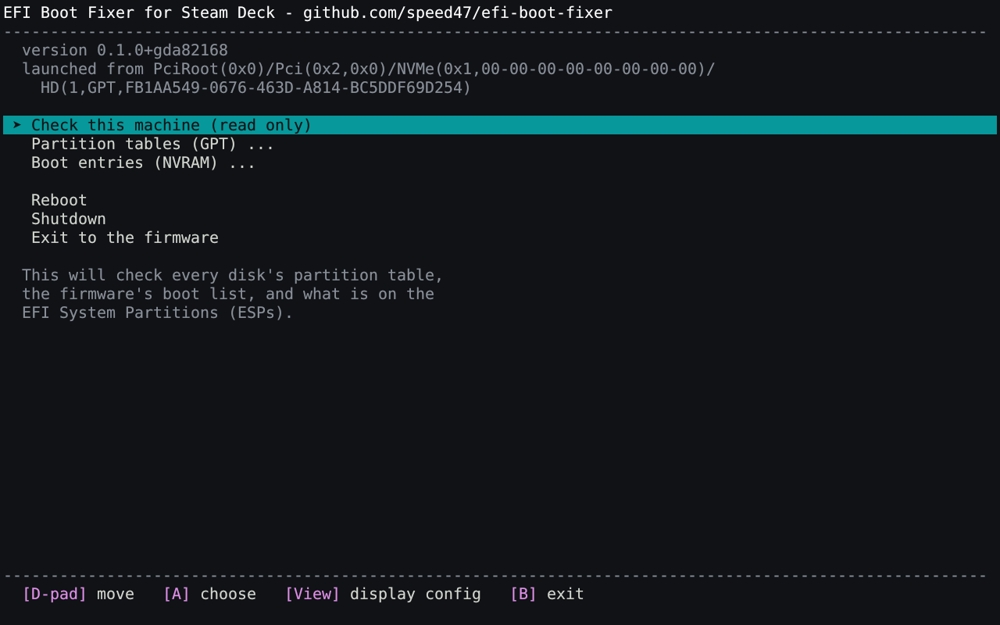
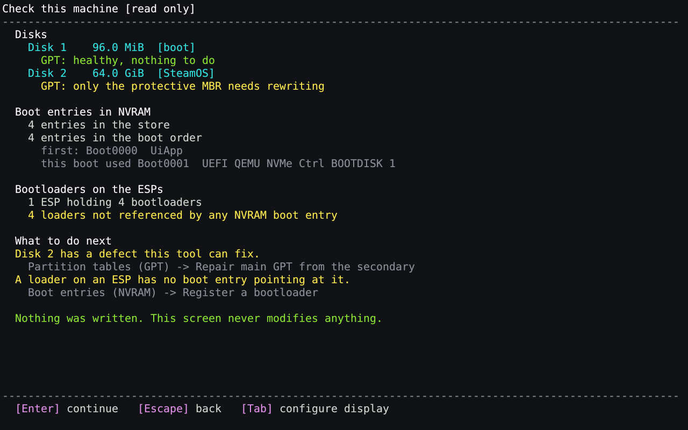
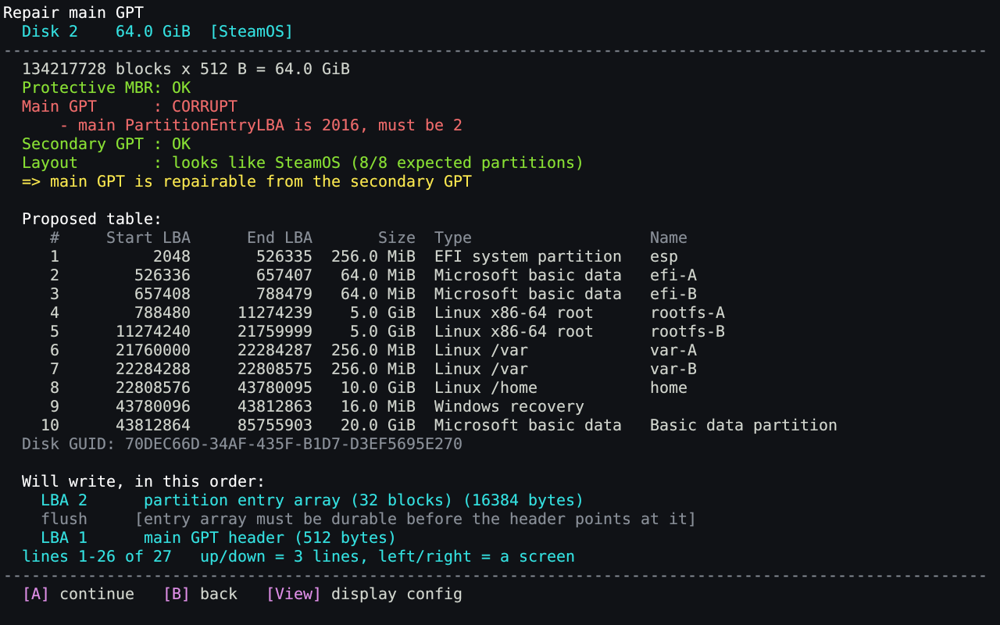
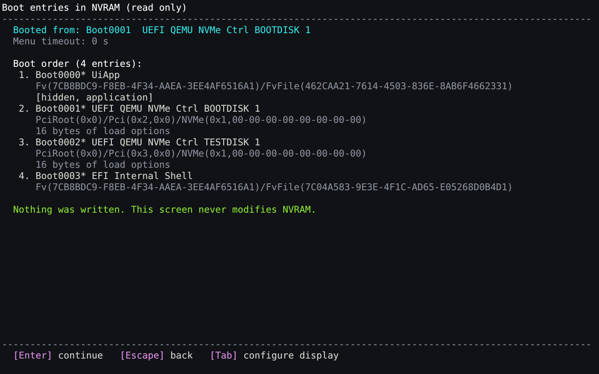

# EFI Boot Fixer for Steam Deck


A UEFI application for inspecting, repairing, backing up and restoring GUID
partition tables (GPT), along with viewing and modifying the NVRAM boot entries
that might get modified or deleted during a SteamOS or Windows upgrade in a
dual-boot setup.

## Why?

When dual-booting SteamOS and Windows, more often than not you'll run into issues
when upgrading them, as they don't tolerate each other very well, and like to take
all the room for themselves (well, especially Windows).

The upgrade to Windows 24H2 is especially infamous with this, symptoms are either:

- Black screen when booting SteamOS, even manually through `steamcl.efi`
- Dropping you to a `grub>` prompt after attempting to boot
- Verbose boot logs ending in `ERROR: Mounting /dev/disk/bypartuuid/<UUIDOFYOURPARTITION> failed.`

This precise upgrade is known to corrupt the main GPT, this is what this tool
was written for, but it now supports more features to (hopefully) always be able to salvage
your Steam Deck that no longer boots, even if you're on the go and don't have any
USB keyboard at hand, and no USB recovery key.

## Screenshots

### The main menu



### Check this machine



### Repairing a corrupt GPT



### Boot entries in NVRAM



## How to use?

### 1. Download it

Grab `bootfixr.efi` and `SHA256SUMS` from the
[latest release](https://github.com/speed47/efi-boot-fixer/releases/latest).

If the ESP is too tight for `bootfixr.efi`, grab `bootfixr-tiny.efi` instead,
it's the same tool, same features, but UPX-compressed and with only one font
size. See [docs/display.md](docs/display.md).

If you want to verify your download:

```sh
sha256sum -c SHA256SUMS
```

### 2. Copy it to the EFI System Partition

Under the SteamOS desktop mode, just drop the binary on the ESP:

```sh
sudo cp bootfixr.efi /esp/EFI/
```

On SteamOS the ESP is normally already mounted at `/esp`. If the Steam Deck no
longer boots, mount its ESP from another Linux machine or a live USB and copy
the file there.

The main advantage of this tool is that it'll be able to help you if corruption
occurs BUT you already have dropped it on your ESP partition before, this way
you won't be needing the USB recovery key nor a keyboard when it happens.

So obviously, it is advised to copy it to your ESP even if everything works for now.

### 3. Boot it

- Shut the Steam Deck down completely.
- Hold **Volume Up (+)** and tap **Power**, keeping Volume Up held until the
  Boot Manager appears.
- Choose **Boot From File**, then the EFI system partition (usually it's the
  one that is preselected), then `EFI`, then `bootfixr.efi`.

### 4. Use it

- Start with "Check this machine", it'll tell you if something is wrong.
- If you're going to ask anyone for help, "Generate a diagnostic report" puts
  everything the machine will say into a text file on the ESP or a USB stick.
- Then "Partition tables (GPT) => Back up both GPTs", before any attempt to fix anything.
  DO NOT SKIP THIS STEP. Even if you have nothing to repair now, having
  a backup is never a bad idea. You can also save the boot entries in the "Backup
  boot configuration" menu, under the NVRAM section.

Note that even if this tool is mainly targeted to the Steam Deck, it should
work on any UEFI-based system.

## Building from source

Requires a Rust toolchain with the `x86_64-unknown-uefi` target:

```sh
rustup target add x86_64-unknown-uefi
make build          # crates/bootfixr/target/x86_64-unknown-uefi/release/bootfixr.efi
make                # list every target
```
See [docs/building.md](docs/building.md) for the details,
[docs/testing.md](docs/testing.md) for the test and QEMU tooling.
